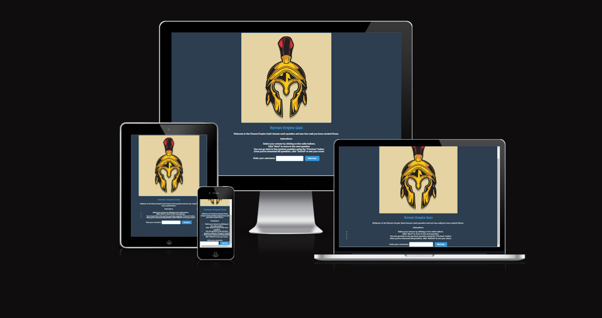
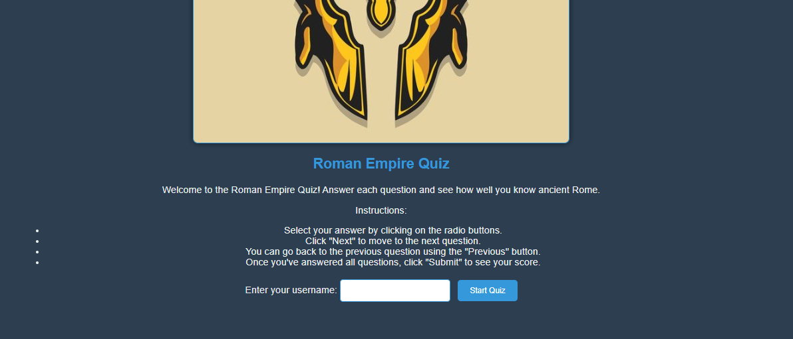
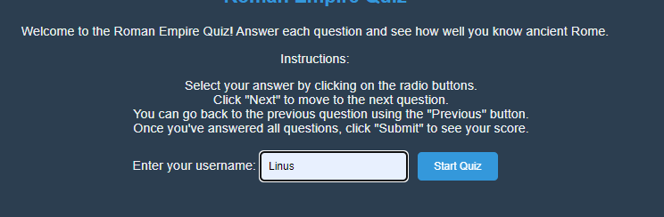
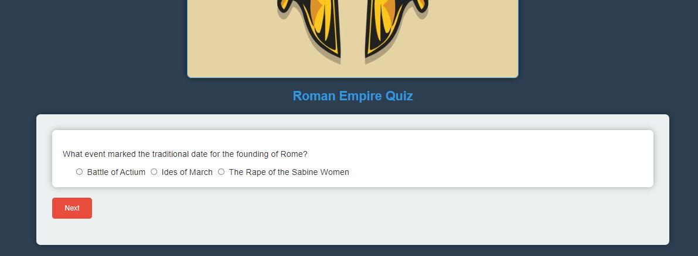
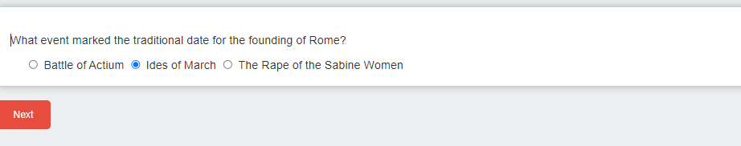
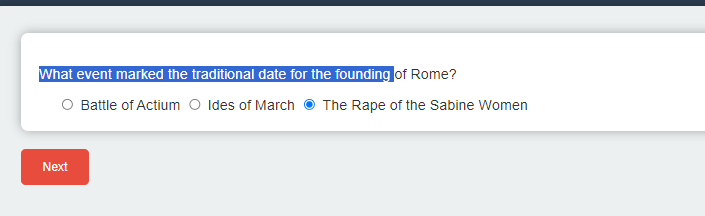
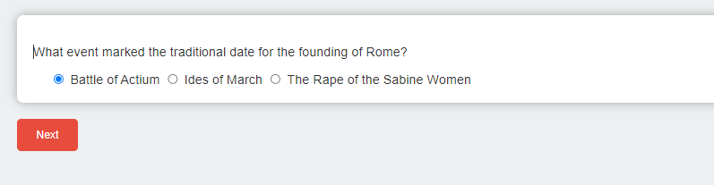

# Roman Empire Quiz
Link to website here (https://linusmolin98.github.io/Roman_empire-quiz/index.html)

## Am i Responsive 

## Project Overview
The Roman Empire Quiz is an interactive web application designed to test and enrich users' knowledge about the Roman Empire. This educational tool combines entertainment with learning, offering a variety of questions that cover significant aspects of Roman history, culture, and achievements.

## Table of Contents
- [Project Overview](#project-overview)
  - [Purpose](#purpose)
  - [Value to Users](#value-to-users)
- [UX Design Elements](#ux-design-elements)
- [Features](#features)
- [Deployment](#deployment)
  - [Deployment Procedure](#deployment-procedure)
- [Testing](#testing)
  - [Lighthouse Report](#lighthouse-report)
- [Credits](#credits)
  - [Content and Media](#content-and-media)
  - [Code Attribution](#code-attribution)
  - [External Resources](#external-resources)
- [Acknowledgements](#acknowledgements)

# Features 

## Navigation

- Upon reaching the site, the user is welcomed by a picture of a roman helmet, some information about how the quiz is played, and the bar where the user have to put in there username to start the quiz. If the user does not put in there username, they will be unable to start the quiz.

## Username 

- Username bar works without errors. 

## Reaching the first question 

- Upon reaching the first question, the user gets three alternatives to answer. The questions are answered through the radiobuttons wich are clickable on the text aswell. At this point there is only a "next" button showing. 

## Radio Buttons 

- Radio buttons working without errors. 

### Purpose
- **Engage users** in the rich history of the Roman Empire through an interactive quiz format.
- **Educate** participants about key events, figures, and cultural aspects of ancient Rome.
- **Track Progress** by allowing users to review their scores and learn from their mistakes.

### Value to Users
- **Interactive Learning**: Enhance understanding of the Roman Empire in an engaging manner.
- **User-Friendly Interface**: Enjoy a seamless experience tailored for ease of use.
- **Track Score**: Monitor improvement over time with direct feedback.

## UX Design Elements
- **Intuitive Navigation**: Ensures users can easily find their way through the quiz.
- **Responsive Design**: Accessible on various devices, providing a consistent experience across platforms.
- **Aesthetically Pleasing**: Thematic visuals and layouts that immerse users in the historical context.
- **Clear Content**: Questions and answers are presented clearly to facilitate learning.

## Features
- **Welcoming Interface**: Users are greeted and prompted to enter their names for a personalized experience.
- **Dynamic Questions**: A pool of questions that randomizes with each attempt for a fresh experience.
- **Immediate Feedback**: Users receive instant feedback on their answers to facilitate learning.
- **Score Summary**: At the end of the quiz, users can review their performance and correct answers.

## Deployment
The Roman Empire Quiz is deployed via GitHub Pages and is accessible [here](https://linusmolin98.github.io/Roman_empire-quiz/).

### Deployment Procedure
1. Navigate to the repository settings on GitHub.
2. Locate the GitHub Pages section and select the main branch as the source.
3. Confirm deployment and access the provided URL to view the live site.

## Testing
- **Browser Compatibility**: Tested on Chrome, Firefox, and Safari to ensure functionality across different platforms.
- **Responsive Design**: Verified on various devices to ensure a consistent user experience.
- **Validation**: HTML, CSS, and JavaScript codes have been validated with no major errors.

### Lighthouse Report

A comprehensive Lighthouse audit confirms high performance, accessibility, best practices, and SEO. Performance could be higher, but with the circumstances given, it´s a result im happy with. 

## Credits

### Content and Media
- Questions and historical content were inspired by reputable history resources and literature on ancient Rome.
- Visual assets were carefully selected from royalty-free image sources to enhance the thematic experience.

### Code Attribution
- Quiz logic and structure adapted from educational resources such as [GeeksforGeeks](https://www.geeksforgeeks.org/how-to-create-a-simple-javascript-quiz/), [SitePoint](https://www.sitepoint.com/simple-javascript-quiz/), and [Coding Ninjas](https://www.codingninjas.com/studio/library/how-to-create-a-javascript-quiz-code).

### External Resources
- Utilized Font Awesome for icons and Google Fonts for typography to improve the visual appeal and user interface.

## Acknowledgements
Special thanks to the Code Institute for providing the initial template and to all the external resources and tutorials that contributed to the successful development of this project.
